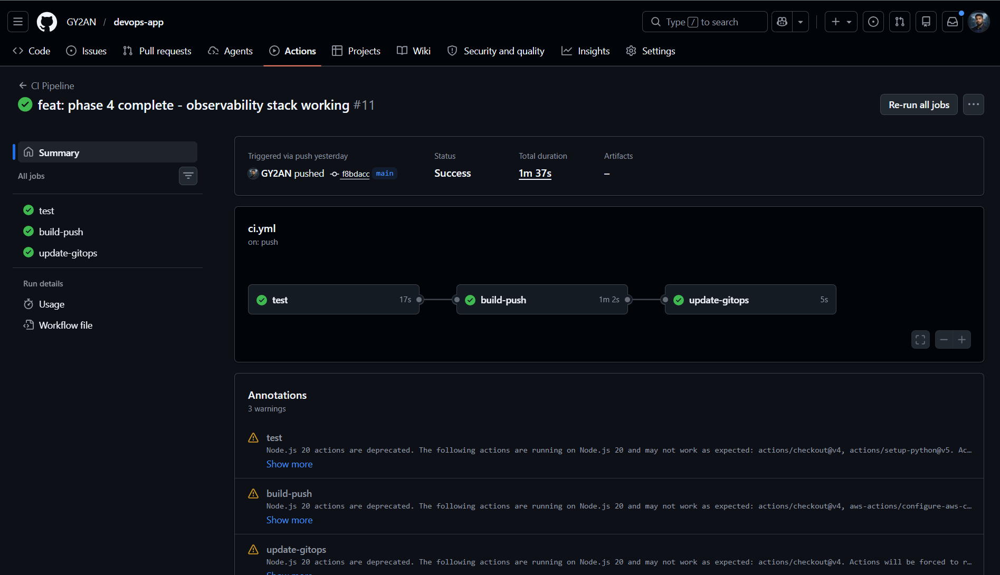
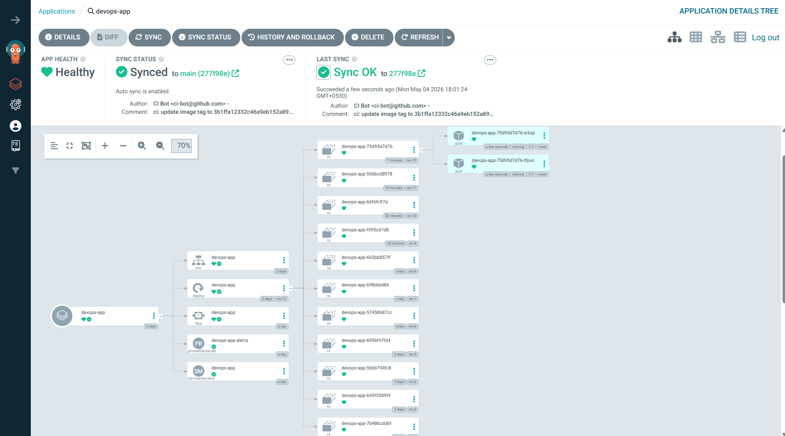
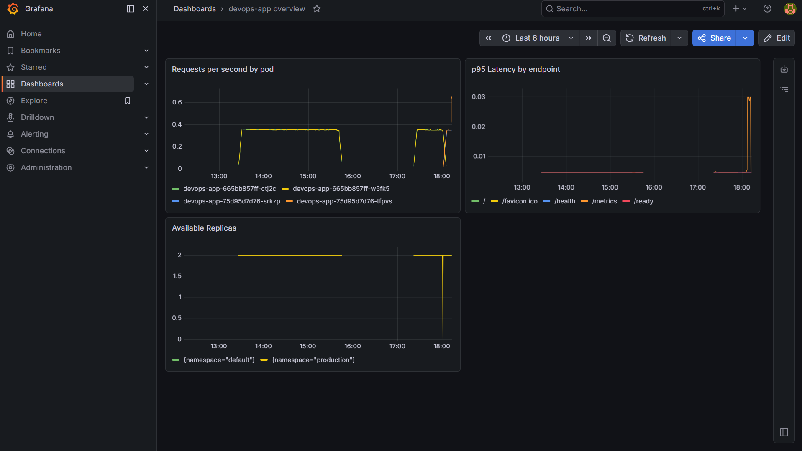
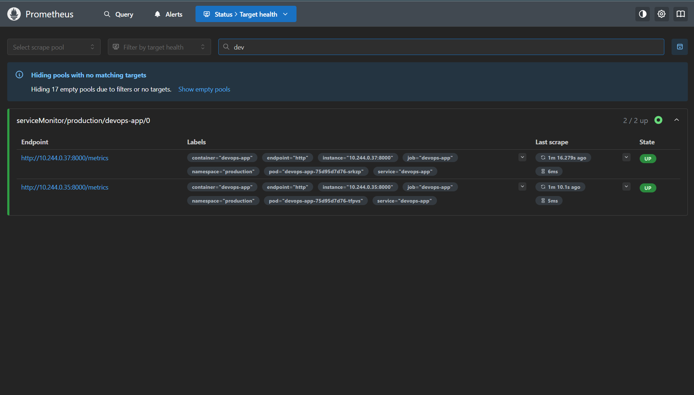
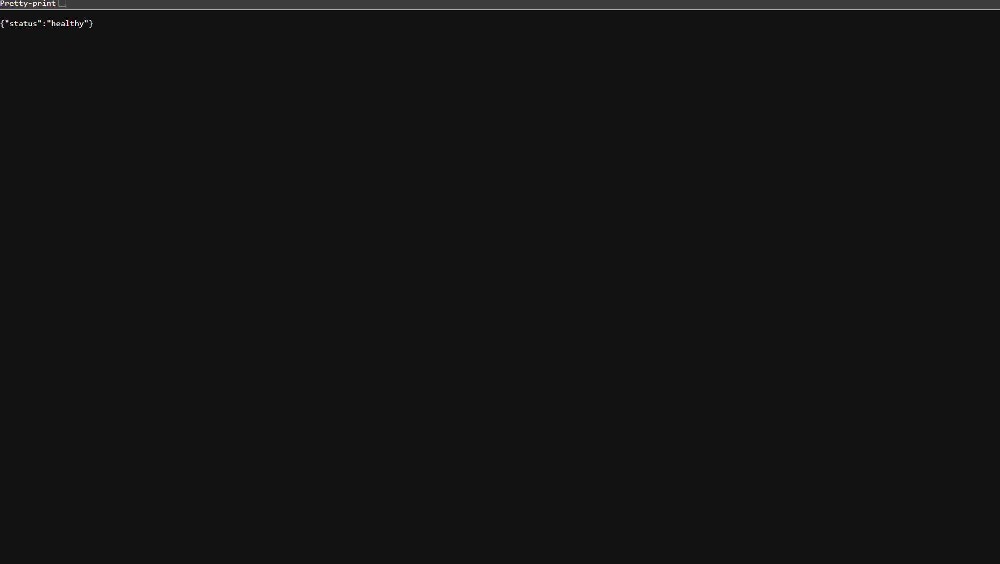

# devops-app — Production-Grade DevOps Portfolio Project

A complete DevOps platform demonstrating CI/CD, GitOps, container orchestration,
and observability — built to production standards.

## Architecture
```
Developer pushes code
        |
        v
+-----------------------------------+
|         GitHub Actions CI         |
|   test > lint > build > scan      |
|   > push ECR > update GitOps      |
+----------------+------------------+
                 |
                 v
+-----------------------------------+
|         devops-gitops repo        |
|    Helm charts + values.yaml      |
+----------------+------------------+
                 | ArgoCD polls every 3 min
                 v
+-----------------------------------+
|         Kubernetes (EKS)          |
|   production namespace            |
|   +-- Deployment (2-10 replicas)  |
|   +-- Service (ClusterIP)         |
|   +-- HPA (CPU + memory)          |
|   +-- ServiceMonitor              |
|   +-- PrometheusRule              |
+----------------+------------------+
                 | scrapes /metrics
                 v
+-----------------------------------+
|        Observability Stack        |
|   Prometheus > Grafana            |
|   AlertManager > alert rules      |
+-----------------------------------+
```

## Screenshots

### CI/CD Pipeline — GitHub Actions

*3-job pipeline: test (17s) → build-push (1m 2s) → update-gitops (5s)*

### GitOps — ArgoCD Application Tree

*ArgoCD showing Healthy + Synced, with full resource tree: Deployment, Service, HPA, PrometheusRule, ServiceMonitor*

### Observability — Grafana Dashboard

*Live metrics: requests/sec by pod, p95 latency by endpoint, available replicas*

### Observability — Prometheus Targets

*Both pods scraped via ServiceMonitor — 2/2 UP, scrape duration ~5-6ms*

### Application Health Check

*FastAPI /health endpoint returning {"status":"healthy"} from production namespace*


## Tech Stack

| Layer | Technology |
|---|---|
| Application | Python 3.11, FastAPI, prometheus-client |
| Containerisation | Docker (non-root, layer-cached) |
| Container Registry | AWS ECR (scan on push) |
| CI Pipeline | GitHub Actions |
| Security Scanning | Trivy (blocks on CRITICAL CVEs) |
| Infrastructure | AWS EKS, Terraform |
| Package Management | Helm |
| GitOps | ArgoCD (automated sync, self-heal) |
| Observability | Prometheus, Grafana, AlertManager |
| Autoscaling | Kubernetes HPA (CPU + memory) |

## How a Deployment Works — End to End

1. Developer pushes code to `main` branch
2. GitHub Actions triggers automatically:
   - Runs `pytest` unit tests and `ruff` linter — fails fast if tests break
   - Builds Docker image tagged with the exact git SHA (e.g. `abc123def`)
   - Scans image with **Trivy** — pipeline fails if any CRITICAL vulnerability found
   - Pushes verified image to **AWS ECR**
   - Checks out `devops-gitops` repo and updates `image.tag` in `values.yaml` to the new SHA
3. **ArgoCD** detects the `values.yaml` change within 3 minutes
4. ArgoCD applies the updated Helm chart to the `production` namespace on EKS
5. Kubernetes performs a **rolling update** — zero downtime, old pods terminate after new ones pass readiness probes
6. **Prometheus** begins scraping the new pods via ServiceMonitor within 15 seconds
7. **Grafana** dashboards reflect live traffic, latency, and replica count

## Rolling Back a Bad Deployment

```bash
# Revert the GitOps repo to the previous commit
git revert HEAD
git push

# ArgoCD detects the revert and automatically redeploys the previous image
# No kubectl commands needed — Git is the single source of truth
```

## Repository Structure
```
devops-app/                          (this repo - application code)
|
+-- .github/
|   +-- workflows/
|   |   +-- ci.yml                   (GitHub Actions pipeline)
|   +-- argocd/
|       +-- application.yaml         (ArgoCD app definition)
+-- app/
|   +-- main.py                      (FastAPI app with /metrics endpoint)
|   +-- routes/
|       +-- health.py                (/health and /ready endpoints)
+-- tests/                           (pytest test suite)
+-- k8s/                             (local dev manifests only)
+-- scripts/
|   +-- refresh-ecr-secret.ps1       (ECR token refresh helper)
+-- Dockerfile                       (non-root, layer-cached)
+-- requirements.txt

devops-gitops/                       (separate repo - GitOps source of truth)
|
+-- charts/
    +-- devops-app/
        +-- Chart.yaml
        +-- values.yaml              (CI updates image.tag on every deploy)
        +-- templates/
            +-- deployment.yaml
            +-- service.yaml
            +-- hpa.yaml
            +-- servicemonitor.yaml
            +-- prometheusrule.yaml
```

## Running Locally

**Prerequisites:** Docker Desktop with Kubernetes enabled, kubectl, helm, AWS CLI configured

```powershell
# 1. Refresh ECR pull secret (required after every laptop restart)
./scripts/refresh-ecr-secret.ps1

# 2. Start port-forwards — run each in a separate terminal
kubectl port-forward svc/argocd-server -n argocd 8090:443
kubectl port-forward svc/devops-app -n production 8081:80
kubectl port-forward svc/kube-prom-stack-grafana -n monitoring 3000:80
kubectl port-forward svc/kube-prom-stack-kube-prome-prometheus -n monitoring 9090:9090

# 3. Test the app
Invoke-RestMethod http://localhost:8081/health
Invoke-RestMethod http://localhost:8081/metrics
```

## Access Points

| Service | URL | Credentials |
|---|---|---|
| Application | http://localhost:8081 | — |
| ArgoCD UI | https://localhost:8090 | admin / see kubectl secret |
| Grafana | http://localhost:3000 | admin / admin123 |
| Prometheus | http://localhost:9090 | — |

## Observability

**Grafana Dashboards:**
- `devops-app overview` — requests/sec by pod, p95 latency by endpoint, available replicas
- Kubernetes cluster overview (import ID: 15760)
- Node exporter full (import ID: 1860)

**Alert Rules:**

| Alert | Condition | Severity |
|---|---|---|
| AppPodsDown | Available replicas < 2 for 1 min | Critical |
| HighRequestLatency | p95 latency > 500ms for 2 min | Warning |

## Security

- Docker image runs as **non-root user** (`appuser`)
- **Trivy** scans every image before push — CRITICAL CVEs block the deployment
- AWS ECR **scan on push** enabled for all images
- Third-party GitHub Actions pinned to **specific version tags** — not `@master`
- After the March 2026 trivy-action supply chain attack, all tags below v0.35.0 were compromised. This project uses `v0.36.0`.
- ECR authentication via docker-registry secret locally / IRSA recommended for production EKS

## Key Design Decisions

**Why two repos?**
The GitOps pattern requires separating application code from deployment configuration.
The `devops-gitops` repo is the single source of truth for what runs in the cluster.
Nothing deploys except through a Git commit — no manual `kubectl apply` ever.

**Why ArgoCD over kubectl apply in CI?**
ArgoCD adds self-healing — if someone manually changes something in the cluster,
ArgoCD reverts it back to what is in Git within minutes. It also provides a full
audit trail and instant rollback by reverting a single commit.

**Why SHA-based image tags?**
Using `latest` makes deployments non-deterministic. Every image is tagged with its
exact git SHA, making every deployment fully traceable to a specific commit.

**Why Trivy with exit-code 1?**
Setting exit-code to 1 on CRITICAL severity turns the scanner from a reporting tool
into a hard security gate. No CRITICAL vulnerability can reach production.

## Cost Estimate (AWS)

| Resource | Cost |
|---|---|
| EKS cluster | ~$0.10/hour |
| 2x t3.medium nodes | ~$0.083/hour |
| ECR storage | ~$0.01/GB/month |
| **Total (running)** | **~$5.50/day** |

> Run `terraform destroy` when not actively demoing.
> Terraform state is stored in S3 so rebuilding the cluster takes 15 minutes.

## What I Learned

- GitOps pattern — why Git as the single source of truth eliminates configuration drift
- How Prometheus ServiceMonitor CRDs wire scrape targets without editing static config
- Why ECR tokens expire every 12 hours and how IRSA solves this permanently on EKS
- How supply chain attacks work and why pinning GitHub Action versions matters
- Rolling update mechanics — how readiness probes gate pod traffic during deploys
- The difference between local dev (docker-registry secret) and production auth (IRSA)

